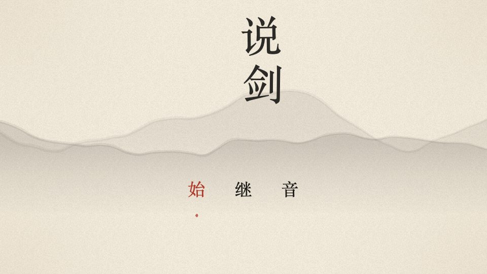
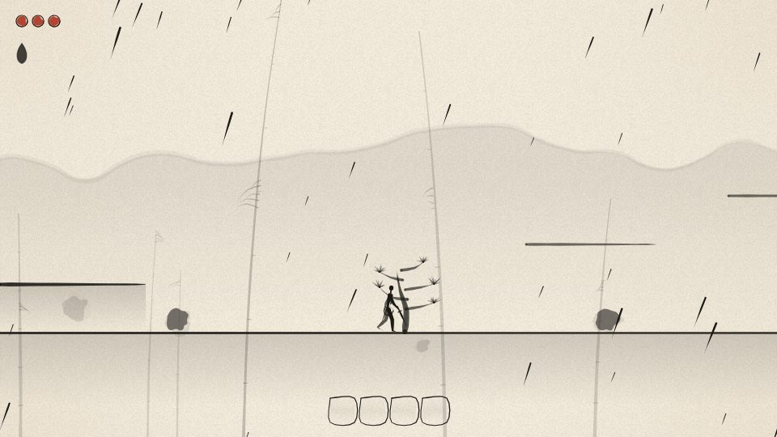
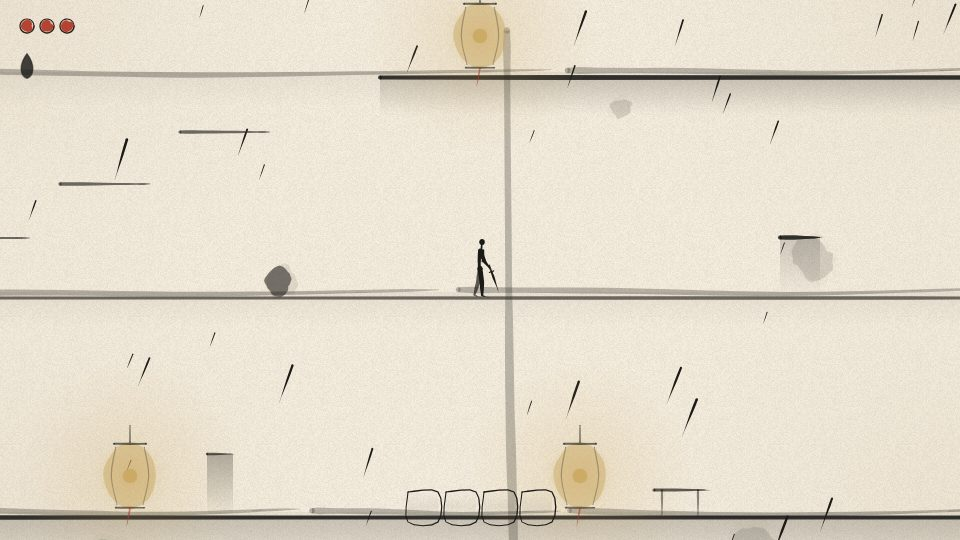
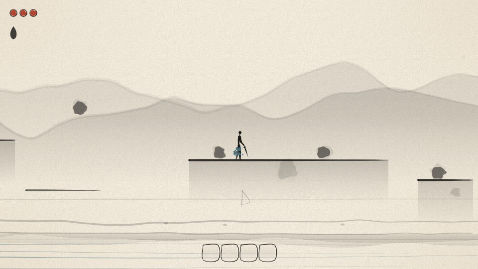
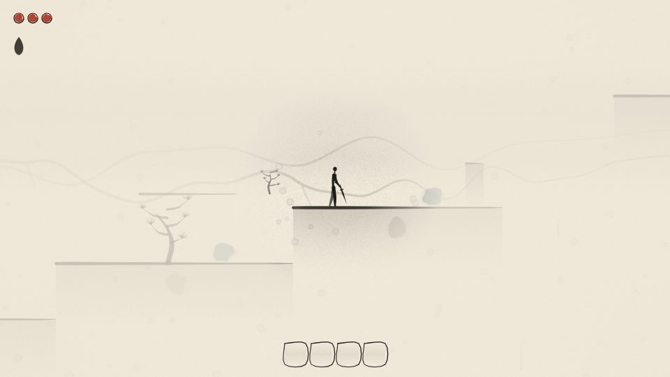
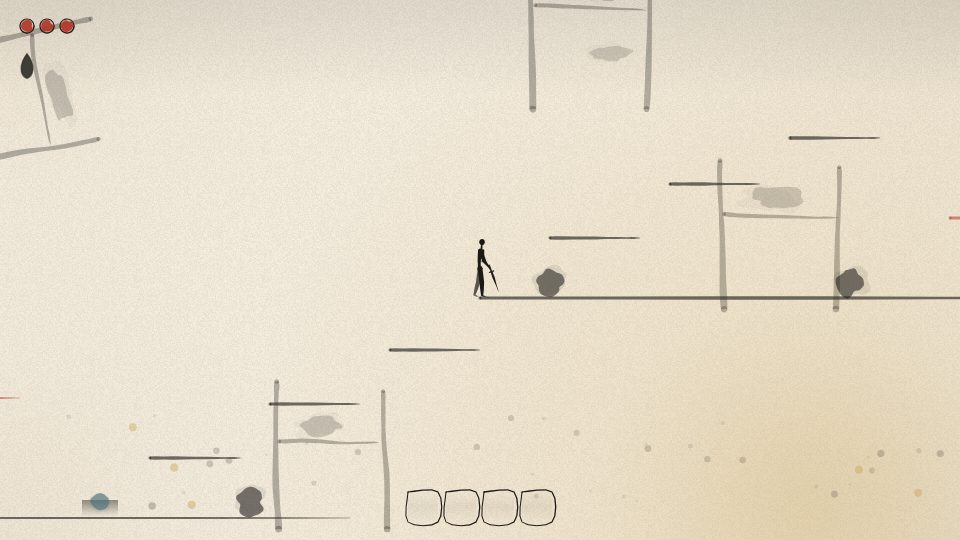
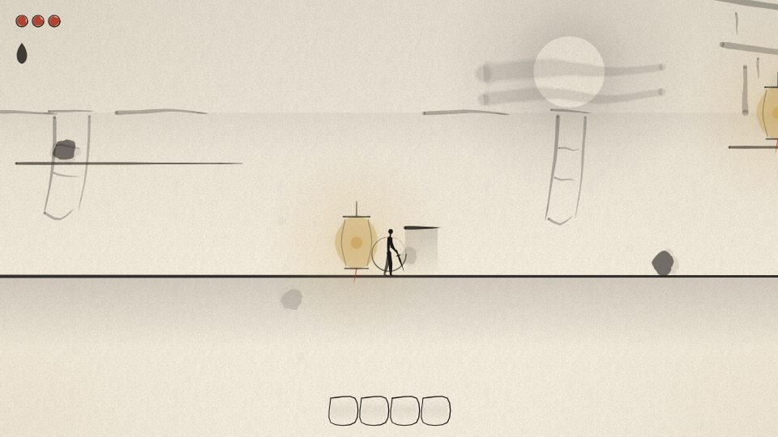
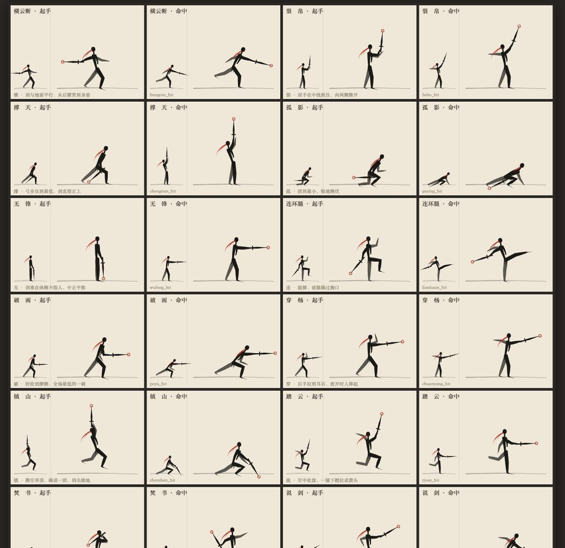
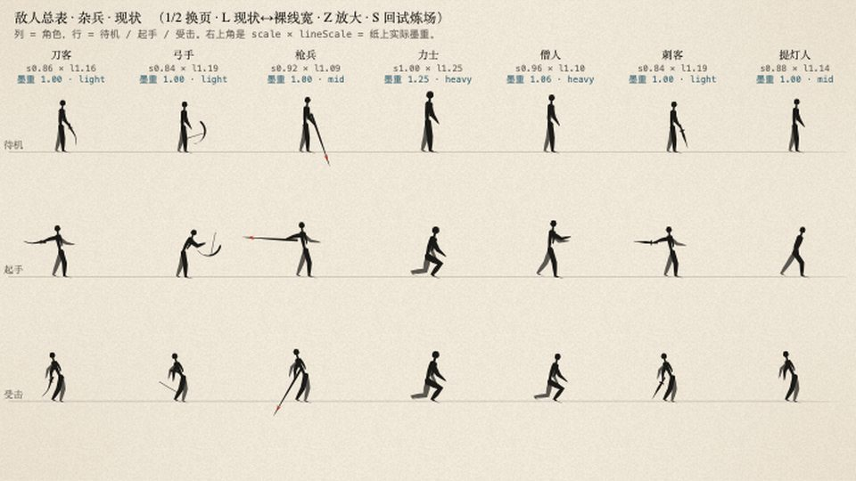
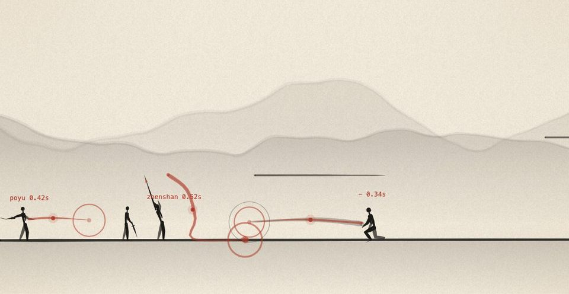

<p align="center"></p>

# 说剑

一款中国水墨风的横版过关游戏。一个不会武功的人，背一柄没开刃的剑，走了六处地方，见了六个人。六个人都死了——也可能一个都没死。这就要看你听的是哪一版。

**在线试玩：<https://xxxxxthhh.github.io/shuojian/>**（桌面浏览器，键盘）

纯浏览器运行，**零外部素材**：所有画面是程序化的毛笔笔触，所有声音是 Web Audio 合成。约三十到五十分钟一周目，四个结局。没有教程——玩法靠自己摸。

## 六处地方

<table>
<tr>
<td></td>
<td></td>
<td></td>
</tr>
<tr>
<td align="center">竹林听雨</td><td align="center">断桥客栈</td><td align="center">长河渡</td>
</tr>
<tr>
<td></td>
<td></td>
<td></td>
</tr>
<tr>
<td align="center">雪照山门</td><td align="center">藏经阁</td><td align="center">城楼夜</td>
</tr>
</table>

## 开始

- **在线**：打开 <https://xxxxxthhh.github.io/shuojian/>。
- **macOS 本地**：双击 `开始游戏.command`（起一个本地静态服务并打开浏览器）。
- **其它系统**：在仓库根目录起任意静态服务，例如 `python3 -m http.server 8765`，访问 `http://127.0.0.1:8765/`。

存档在浏览器本地。下面只列键位，不讲用法。

| 键 | |
|---|---|
| A / D，← / → | 左右 |
| W / ↑ | 上、跳、互动 |
| S / ↓ | 下 |
| 空格 | 跳、确认 |
| J，鼠标左键 | 攻击、确认 |
| K，鼠标右键 | 按住 |
| L / Shift | 身法 |
| U / I / O / P | 四个格子 |
| F | 互动 |
| Esc | 暂停 |

## 它是什么样的游戏

- **只有一种资源。** 没有第二条槽。怎么花、怎么回，关卡会让你自己发现。
- **招是看会的，不是打会的。** 每个对手都在教你一样东西，前提是你肯看。
- **倒下的人，杀或不杀，没有一个字提示。** 你的选择不改变后面的路，只改变故事怎么被讲出来。
- **一个说书人在讲这一切。** 从第四回起，他说的开始和你做的对不上。
- **四个结局。** 取决于你学会了多少，和留下了几个人。

## 手册

打完之后想知道全部的来龙去脉：**[说剑手札](https://xxxxxthhh.github.io/shuojian/docs/手册.html)**（源稿 `docs/手册.md`）。故事、人物小传、世界设定、十二招、敌人图鉴、逐回导览，说书人口吻，页边有校注。**含全部剧透**，建议通关再看。

## 程序化水墨

没有一张贴图。人物是渐细的笔触多边形，四肢一笔到底，躯干两笔带飞白；山、竹、水、雪、火、月全是运行时画的；命中的墨点会落到地上晕开。

<p align="center"></p>
<p align="center"><sub>十二招的起手与命中姿势（左为游戏内尺寸，右为放大）</sub></p>

<table>
<tr>
<td></td>
<td></td>
</tr>
<tr>
<td align="center">七种路人的待机 / 起手 / 受击</td><td align="center">三种起手式预警（试炼场）</td>
</tr>
</table>

## 仓库结构

```
index.html          入口（脚本加载顺序在此写死，经典脚本，无构建步骤）
src/                游戏源码：core / render / audio / combat / entity / level / story / ui / data
dev/                无头自检与工具：smoke、player-check、level-check、enemy-check、autoplay（八关通关机器人）…
docs/               手册与图片
_spec/              设计总纲、剧本总纲、接口契约与决议、各模块笔记、QA 截图（含剧透）
```

自检（Node，无需浏览器）：

```
node dev/smoke.js && node dev/player-check.js && node dev/level-check.js && node dev/script-check.js && node dev/enemy-check.js
```

`node dev/autoplay.js all --mercy` 会让机器人从头打到尾。

## 怎么做出来的

由一队 AI 代理（Claude Code agent team）并行实现，人只做拆解、裁定与验收：

1. 先写设计总纲与接口契约，再分引擎、水墨、音频、剧本、战斗、敌人、关卡七路并行。
2. 玩家在前两回撞出两次卡死之后，造了一个能通关八关的机器人把后六回全部走了一遍，挖出十二个会毁掉一次通关的问题。
3. 第二波四路做可靠性、手感、敌人可读性与一关一景的打磨。

过程中留下二十七条契约决议，多数是「谁是某份数据的唯一写入者」这一类，防的是静默失效。全部在 `_spec/CONTRACTS.md`；评审与复盘在 `_spec/REVIEW.md`。

剧本一百八十八个节点，禁用词表里有「按键」「菜单」「血量」「技能」「教程」。
